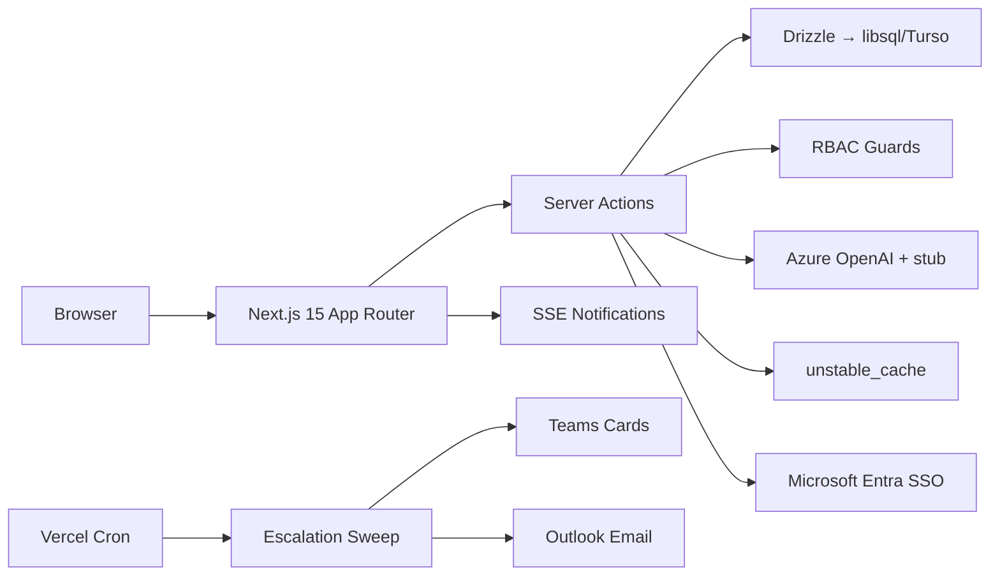

# AtomicPulse

> **AI-first Goal Setting & Tracking Portal for the Enterprise**
>
> Built for the AtomQuest Hackathon — combines the fluidity of Microsoft Loop, the structure of Workday, and the intelligence of an AI Copilot into a single audit-ready performance platform.

---

## Quick Start (Zero Configuration)

```bash
npm install
npx drizzle-kit push --force
npm run db:seed
npm run dev
# → http://localhost:3000 → pick any of 12 demo personas
```

Everything works offline. No API keys, no cloud services, no external dependencies needed for the demo.

---

## Evaluation Criteria Mapping

### 1. Functionality of the Portal

The portal works end-to-end across all roles:

| Flow | Status | Proof |
|------|--------|-------|
| Employee creates & submits goals | Working | `lifecycle-chain.spec.ts` |
| Manager approves/locks goals | Working | `manager-review.spec.ts` |
| Quarterly check-ins with scoring | Working | `check-ins.spec.ts` |
| Shared goals push + achievement sync | Working | `shared-goals.spec.ts` (5 tests) |
| Admin audit trail + exports | Working | `admin.spec.ts` + CSV/XLSX APIs |
| AI Copilot (live Azure OpenAI) | Working | `copilot.spec.ts` + live insights |
| Escalation engine | Working | `escalations.spec.ts` + cron API |
| Analytics (QoQ, heatmap, effectiveness) | Working | `analytics.spec.ts` (4 tests) |

**Lifecycle chain test**: Single Playwright test walks Diego (employee) submit → Morgan (manager) approve → Diego check-in — on one database without resets.

---

### 2. Adherence to BRD

| BRD Requirement | Implementation | Test |
|----------------|---------------|------|
| Total weightage = 100% | `GoalSheetDraftSchema.superRefine` | 4 unit tests |
| Min weightage 10% per goal | `GoalDraftSchema.weightageBp.min(1000)` | 2 unit tests |
| Max 8 goals per employee | `.max(8)` on goals array | 2 unit tests |
| UoM: Numeric, %, Timeline, Zero | 6 types in `UomTypeEnum` | 22 scoring tests |
| Manager approve → locked | State machine + RBAC | 8 state tests + e2e |
| Return for rework with comment | `ReturnSheetSchema` + action | e2e `return-with-comment` |
| Shared goals (read-only title/target) | Server drops edits for `source === "shared"` | 5 e2e tests |
| Achievement sync across linked sheets | `syncSharedAchievement` propagation | Server action + e2e |
| Quarterly windows (Q1 Jul, Q2 Oct, Q3 Jan, Q4 Mar) | `defaultCheckInWindows` + enforcement | 10 window tests |
| Check-in window enforcement | `upsertCheckIn` checks `opensAt ≤ now ≤ closesAt` | Unit + e2e |
| CSV/XLSX export of achievement data | `/api/exports/achievement.csv` + `.xlsx` | e2e export tests |
| Audit trail for post-lock changes | Insert-only `audit_event` table | Admin UI + CSV export |

---

### 3. User Friendliness

- **Command palette** (`⌘K`) — search goals, people, navigate anywhere instantly
- **AI Copilot** (`⌘J`) — ask questions, get goal suggestions, run skills
- **Responsive design** — works on mobile (375px) through desktop (1920px)
- **Loading skeletons** — no flash of blank content during navigation
- **Error boundaries** — graceful "Something went wrong" with retry button
- **Live notifications** — SSE-powered badge with dropdown panel
- **Validation feedback** — weightage ring turns red when over 100%, submit disabled until valid
- **Role-appropriate views** — employees see their goals, managers see team, admins see org
- **Dark mode** — system preference detection + manual toggle
- **Touch targets** — minimum 44px on all interactive elements for mobile

---

### 4. Presence of Bugs — Test Proof

| Suite | Tests | Coverage |
|-------|-------|----------|
| Unit (Vitest) | **152 pass** | Scoring, validation, state machine, edge cases, escalation, analytics |
| E2E (Playwright) | **45+ specs** | Auth, goals, review, check-ins, shared goals, admin, analytics, escalations, governance |
| TypeScript | **0 errors** | Strict mode across 100+ files |
| Build | **Success** | 28 routes, 102kB shared JS, 33kB middleware |

**Edge cases tested**: division-by-zero in scoring, off-by-one-bp weightage boundaries, millisecond window boundaries, negative inputs, unicode in titles, null manager chains, double-submit prevention, role-based access blocks.

---

### 5. Good-to-Have Features (Section 5 BRD)

| Feature | Depth |
|---------|-------|
| **AI Copilot** | 7 skills (generate goals, score analysis, trend summary, risk detection) with Zod-validated structured output. Live Azure OpenAI + deterministic stub fallback. |
| **Microsoft Entra SSO** | Real `@azure/msal-node` — authorization code flow, user upsert, profile sync |
| **Graph Org Sync** | Pages `/v1.0/users`, resolves manager chains, maps roles from AD group membership |
| **Teams Notifications** | Adaptive Card 1.5 with deep links for submit/approve/return/check-in/escalation |
| **Outlook Email** | Graph sendMail with HTML templates for all lifecycle events |
| **Escalation Engine** | 3 configurable triggers, chain progression (owner → manager → skip-level → HR), deduplication |
| **Real-time Notifications** | SSE stream with 8s polling, live unread badge, notification dropdown |
| **Performance Analytics** | QoQ trends, heatmap, thrust area distribution, manager effectiveness, UoM mix charts |
| **RBAC Matrix** | Permission guards on every server action and API route |
| **Audit Trail** | Insert-only event log, viewable at `/admin/audit`, exportable CSV |

---

### 6. Cost Optimisation

| Component | Cost | Strategy |
|-----------|------|----------|
| Hosting | **$0** (Vercel Hobby) | Serverless functions, pay-per-invocation |
| Database | **$0** (Turso free tier) | 500M row reads/mo, edge replicas |
| AI | **$0** in demo (stub mode) | 8s timeout + fallback prevents runaway |
| Auth | **$0** (built-in MSAL) | No Auth0/Clerk subscription |
| Notifications | **$0** (Teams webhook + Graph) | Uses existing Microsoft 365 |
| Cache | **$0** (framework-level) | `unstable_cache` — no Redis |
| CDN | **$0** (Vercel Edge) | Immutable headers for static assets |
| **Total (50 users)** | **$0–$29/mo** | |

**Architecture efficiency:**
- Shared JS bundle: 102kB (tiny for a full-featured app)
- Middleware: 33kB (runs at edge, <1ms latency)
- Batch queries: `inArray` for goals/check-ins (1 query not N+1)
- Cache: 60s escalation, 300s analytics, tag-based invalidation
- No external services: everything runs on Vercel + Turso + Azure OpenAI

---

## Architecture



---

## Demo Personas

| Email | Role | State |
|-------|------|-------|
| `priya@atomic.demo` | Admin | Full org view, audit, exports |
| `morgan@atomic.demo` | Manager | 5 reports, pending approvals |
| `diego@atomic.demo` | Employee | Draft sheet (goal creation) |
| `alex@atomic.demo` | Employee | Submitted (awaiting review) |
| `jordan@atomic.demo` | Employee | Approved (check-in flow) |

Sign in at `/sign-in` — no passwords needed, just click a persona.

---

## Technology Stack

| Layer | Choice |
|-------|--------|
| Framework | Next.js 15 (App Router, RSC, Server Actions) |
| Language | TypeScript strict |
| Styling | Tailwind CSS v4 + custom design system |
| Database | Drizzle ORM + libsql (Turso-compatible) |
| AI | Vercel AI SDK + Azure OpenAI (`@ai-sdk/azure@^2`) |
| Auth | Microsoft Entra ID (MSAL) + Demo Mode |
| Hosting | Vercel (Mumbai `bom1`, serverless) |
| Testing | Vitest (unit) + Playwright (e2e) |
| Integrations | Microsoft Graph, Teams, Outlook |

---

## Running Tests

```bash
npm run typecheck    # TypeScript strict — 0 errors
npm test             # 152 unit tests — <1s
npm run ai:eval      # 8 AI skill schema tests
npm run e2e          # 45+ Playwright specs — ~3 min
npm run build        # Production build — 28 routes
```

---

## Deployment

```bash
npx vercel --prod
```

Required env vars: `DATABASE_URL`, `SESSION_SECRET`, `AI_MODE=stub`, `AUTH_MODE=demo`.

---

## Repository

**GitHub**: [github.com/Adit-Jain-srm/AtomicPulse](https://github.com/Adit-Jain-srm/AtomicPulse)

---

## Developer

**Adit Jain** | [GitHub](https://github.com/Adit-Jain-srm) | [LinkedIn](https://www.linkedin.com/in/-adit-jain) | [Resume](https://canva.link/Adit-Jain-CV)
