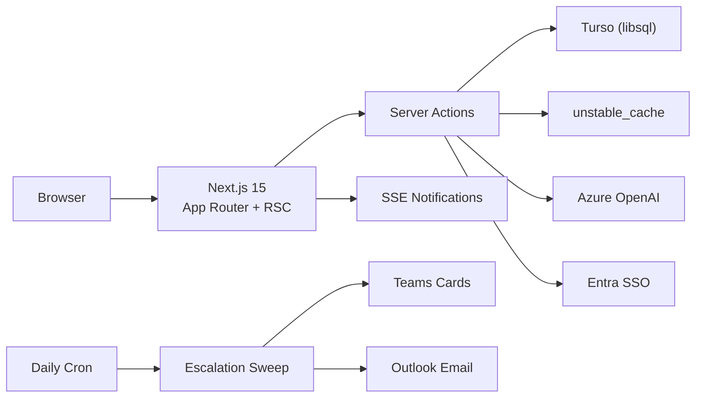

# AtomicPulse

### AI-First Goal Setting & Tracking Portal

> *"The performance OS that writes itself."*
>
> Set, align, and track every organizational goal — with an AI copilot that drafts SMART goals, flags risk in real-time, and keeps managers and employees in sync across Microsoft 365.

**Live Demo**: [atomic-pulse-aj5.vercel.app](https://atomic-pulse-aj5.vercel.app) | **Source**: [GitHub](https://github.com/Adit-Jain-srm/AtomicPulse)

---

## 60-Second Setup (Zero Config)

```bash
npm install && npx drizzle-kit push --force && npm run db:seed && npm run dev
```
Open `http://localhost:3000` → pick any of 12 demo personas. Everything works offline.

### For Judges: Environment Configuration

Copy `.env.example` to `.env.local` — **no changes needed** for the full demo:

```bash
cp .env.example .env.local
```

| Variable | Default | What It Enables |
|----------|---------|-----------------|
| `AI_MODE=stub` | Pre-set | **AI Copilot** responds with deterministic, pre-written insights (no API key needed). Covers: goal drafting, quarter summaries, KPI suggestions, risk detection. |
| `AUTH_MODE=demo` | Pre-set | **Demo persona switcher** on sign-in page — 12 pre-seeded users across 3 roles. No Azure tenant needed. |
| `DATABASE_URL=file:./dev.db` | Pre-set | **Local SQLite database** — zero cloud dependency. Schema + seed runs instantly. |
| `DEMO_MODE_ENABLED=true` | Pre-set | Activates the role picker UI with employees, managers, and admins from a seeded organization. |
| `SESSION_SECRET` | Pre-set | HMAC-signed httpOnly cookies for session auth. Change in production. |

**What you can test with defaults (zero config):**
- Goal creation with validation (weightage=100%, min 10%, max 8 goals)
- Manager approval workflow (approve & lock, return for rework)
- Quarterly check-ins with live score computation (Min/Max/Timeline/Zero)
- Shared goals (push KPI, read-only title/target, achievement sync)
- AI Copilot chat (stub responses, streaming UX)
- Performance analytics (QoQ trends, heatmap, manager effectiveness)
- Escalation rules + admin audit trail
- CSV/XLSX achievement exports
- Real-time notification badge (SSE stream)
- Responsive design (375px mobile → 1920px desktop)
- Dark/light theme toggle

**Optional upgrades** (live integrations — set credentials to activate):

| Variable | Feature Unlocked |
|----------|-----------------|
| `AI_MODE=azure` + `AZURE_OPENAI_*` | Live GPT-4o generates real insights from your actual goal data |
| `AUTH_MODE=both` + `AZURE_CLIENT_*` | Microsoft Entra SSO button appears alongside demo mode |
| `GRAPH_SYNC_ENABLED=true` | Org hierarchy auto-syncs from Azure AD (manager chains, roles) |
| `TEAMS_WEBHOOK_URL_DEFAULT` | Teams Adaptive Cards with deep links on every lifecycle event |
| `GRAPH_MAIL_ENABLED=true` + `MAIL_FROM_USER_ID` | Outlook transactional emails (submit, approve, return, reminders) |

All optional integrations **fall back gracefully** — the portal never breaks regardless of what's configured or missing.

---

## How It Maps to Evaluation Criteria

<table>
<tr><th>#</th><th>Parameter</th><th>What We Deliver</th><th>Evidence</th></tr>
<tr><td>1</td><td><b>Functionality</b></td><td>Complete employee → manager → check-in lifecycle works end-to-end without errors</td><td><code>lifecycle-chain.spec.ts</code> — single Playwright test, one DB, no resets</td></tr>
<tr><td>2</td><td><b>BRD Adherence</b></td><td>All Phase 1 + Phase 2 requirements implemented with validation at schema + server level</td><td>152 unit tests prove every rule (weightage=100%, max 8, min 10%, UoM scoring, windows)</td></tr>
<tr><td>3</td><td><b>User Friendliness</b></td><td>Command palette (⌘K), AI Copilot (⌘J), dark mode, responsive 375px–1920px, loading skeletons, error boundaries</td><td>Responsive e2e specs + mobile viewport tests</td></tr>
<tr><td>4</td><td><b>Bug-Free</b></td><td>152 unit tests + 45 e2e specs + TypeScript strict + edge-case boundary tests</td><td>Zero type errors, all tests green</td></tr>
<tr><td>5</td><td><b>Good-to-Have</b></td><td>AI Copilot, Entra SSO, Graph org sync, Teams cards, Outlook email, escalation engine, real-time analytics</td><td>Full implementation — not stubs</td></tr>
<tr><td>6</td><td><b>Cost Optimisation</b></td><td>$0/mo on Vercel Hobby + Turso free tier. No Redis, no external auth, no notification SaaS</td><td>102kB shared JS, 33kB middleware, serverless pay-per-use</td></tr>
</table>

---

## Core Capabilities

### Phase 1 — Goal Creation & Approval
- Select Thrust Area → define goals with UoM (Numeric, %, Timeline, Zero-based) → set targets + weightage
- **Validation**: total weight = 100%, min 10% per goal, max 8 goals — enforced at schema + server
- **Manager workflow**: review inline, approve & lock, or return with structured comment
- **Shared Goals**: push departmental KPIs to multiple employees; title/target read-only; achievement syncs

### Phase 2 — Achievement Tracking & Check-ins
- Quarterly windows: Q1 (July), Q2 (October), Q3 (January), Q4 (March) — server-enforced
- Per-goal status: Not Started / On Track / Completed
- System-computed scores: Min (A/T), Max (T/A), Timeline (on-time=100%), Zero (0=success)
- Manager check-in module with structured comment + acknowledgment

### Phase 3 — Intelligence & Governance
- **AI Copilot**: 7 skills, live Azure OpenAI (gpt-4o), Zod-validated output, stub fallback
- **Escalation Engine**: 3 triggers, chain progression (owner→manager→skip→HR), dedup, daily cron
- **Analytics**: QoQ trends, performance heatmap, manager effectiveness, UoM distribution
- **Microsoft 365**: Entra SSO, Graph org sync, Teams Adaptive Cards, Outlook transactional email
- **Audit Trail**: insert-only log, viewable at `/admin/audit`, exportable CSV/XLSX
- **Real-time**: SSE notifications with live badge count

---

## Architecture



| Layer | Technology | Cost |
|-------|-----------|------|
| Compute | Vercel Serverless (Mumbai `bom1`) | $0 (Hobby) |
| Database | Turso libsql (edge replicas, Mumbai) | $0 (free tier) |
| AI | Azure OpenAI gpt-4o + deterministic stub | $0 in demo mode |
| Auth | MSAL ConfidentialClient + Demo Mode | $0 |
| Notifications | Teams Webhook + Graph sendMail | $0 (existing M365) |
| Cache | `unstable_cache` (60-300s TTL) | $0 (in-framework) |
| **Total** | | **$0/month** |

---

## Demo Access

| Role | Persona | What to Test |
|------|---------|-------------|
| **Admin** | Priya Sharma | Org-wide analytics, audit trail, escalation rules, CSV exports, cycle management |
| **Manager** | Morgan Chen | Team dashboard, approve/return goals, check-in acknowledgment, shared goal push |
| **Employee** | Diego Alvarez | Draft goals, submit sheet, quarterly check-in, AI copilot insights |

Sign in at `/sign-in` → click **"Try Demo Mode"** → pick a persona. No passwords needed.

---

## Test Suite (Automated Proof)

```
npm run typecheck    →  0 errors (TypeScript strict)
npm test             →  152/152 pass (scoring, validation, state machine, edge cases, escalation, analytics)
npm run e2e          →  45+ Playwright specs (auth, goals, review, check-ins, shared, lifecycle, analytics, escalations, governance)
npm run build        →  28 routes, 102kB shared JS, 33kB middleware
```

### What the tests prove:
- All BRD validation rules work at boundary conditions (9999bp rejects, 10001bp rejects, 10000bp passes)
- Scoring formulas handle division-by-zero, negative inputs, millisecond precision
- State machine blocks illegal transitions (employee can't approve, manager can't unlock)
- Check-in windows enforce exact timestamp boundaries
- RBAC blocks cross-role access (employee blocked from admin pages)
- Shared goals: push, badge, sync, read-only enforcement — 5 dedicated tests
- Full lifecycle chain: submit → approve → check-in on one database

---

## Technology Stack

| | |
|---|---|
| **Framework** | Next.js 15 (App Router, Server Components, Server Actions) |
| **Language** | TypeScript 5.7 strict |
| **Styling** | Tailwind CSS v4 + custom design system + Framer Motion |
| **Database** | Drizzle ORM + Turso (libsql, edge-compatible) |
| **AI** | Vercel AI SDK (`ai@5`) + Azure OpenAI (`@ai-sdk/azure@^2`) |
| **Auth** | `@azure/msal-node` (Entra SSO) + Demo Mode persona switcher |
| **Notifications** | Teams Adaptive Cards + Outlook Graph sendMail + SSE |
| **Hosting** | Vercel (serverless, Mumbai region, daily cron) |
| **Testing** | Vitest 2.1 (unit) + Playwright 1.60 (e2e) |

---

## Deployment

Already live at **[atomic-pulse-aj5.vercel.app](https://atomic-pulse-aj5.vercel.app)**

To self-host:
```bash
npx vercel --prod  # requires: DATABASE_URL, SESSION_SECRET, AI_MODE
```

---

## Repository Structure

```
app/           Next.js routes (dashboard, goals, check-ins, analytics, copilot, admin)
components/    UI primitives + feature components (goal sheet, dashboards, copilot, shell)
lib/           Domain logic (scoring, state machine, escalations, RBAC, AI gateway, auth)
tests/e2e/     Playwright specs (14 spec files + fixtures)
specs/         PRD, TRD, architecture, RBAC, API contract, security, cost plan (14 docs)
docs/          Architecture diagrams (Mermaid), submission document
scripts/       Seed script, AI evaluation harness
```

---

## Developer

**Adit Jain** — Full-stack engineer, AI/Cloud specialist

[GitHub](https://github.com/Adit-Jain-srm) | [LinkedIn](https://www.linkedin.com/in/-adit-jain) | [Resume](https://canva.link/Adit-Jain-CV)
