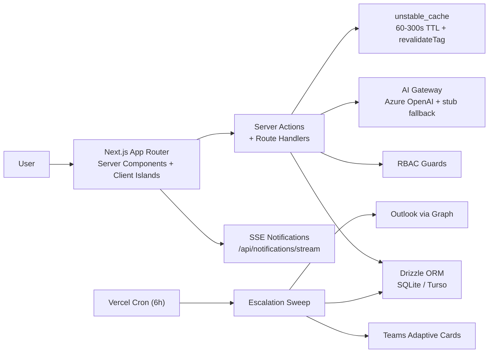

# AtomicPulse

> **AI-first Goal Setting & Tracking Portal for the Enterprise**
>
> Built for the AtomQuest hackathon — combines the fluidity of Microsoft Loop, the structure of Workday, and the intelligence of an AI Copilot into a single audit-ready performance platform.

---

## Quick Start

```bash
# 1. Install dependencies
npm install

# 2. Create the local SQLite database and seed demo data
npx drizzle-kit push --force
npm run db:seed

# 3. Launch the development server (Demo Mode enabled by default)
npm run dev
# → http://localhost:3000 → pick any of 12 demo personas
```

Every flow — goal authoring, manager review, quarterly check-ins, AI Copilot, analytics, escalations, exports — is fully functional offline against the seeded organization.

---

## Features

### Phase 1 — Goal Creation & Approval
- Employee interface: select Thrust Area, define goals with UoM (Numeric, %, Timeline, Zero-based), set targets and weightage
- Validation rules enforced at schema + server level: total weightage = 100%, min 10% per goal, max 8 goals
- Manager (L1) approval workflow: review, edit inline, return for rework with structured comments
- On approval, goals are locked — no edits without Admin unlock
- Shared Goals: admin/manager pushes departmental KPIs; recipients adjust weightage only; achievement syncs automatically

### Phase 2 — Achievement Tracking & Quarterly Check-ins
- Quarterly update interface for employees to log actual achievement against planned targets
- Status tracking per goal: Not Started / On Track / Completed
- Manager check-in module: view planned vs. actual, add structured check-in comment
- System-computed scores: Min (achievement/target), Max (target/achievement), Timeline (on-time = 100%), Zero (0 = success)

### Phase 3 — Analytics & Escalations
- QoQ goal achievement trends (individual, team, department)
- Performance heatmap: composite scores per person per quarter
- Goal distribution: breakdown by Thrust Area, UoM type, and status
- Manager effectiveness dashboard: check-in completion rates across L1 managers
- Configurable escalation rules: no_submit, no_approve, no_checkin triggers
- Escalation chain: employee → manager → skip-level → HR with configurable day thresholds
- Real-time notifications via SSE with live badge count

---

## Technology Stack

| Layer | Technology |
|-------|-----------|
| Framework | Next.js 15 (App Router, Server Components, Server Actions) |
| Language | TypeScript (strict mode) |
| Styling | Tailwind CSS v4 + custom design system primitives |
| Database | Drizzle ORM + libsql/SQLite (local) / Turso (production) |
| AI | Vercel AI SDK (`ai@5`) + Azure OpenAI (`@ai-sdk/azure@^2`) with stub fallback |
| Auth | Demo persona switcher + Microsoft Entra ID (MSAL) — dual mode |
| Hosting | Vercel (Mumbai `bom1` region, serverless functions, Cron) |
| Testing | Vitest (unit) + Playwright (e2e) |
| Integrations | Microsoft Graph, Teams Adaptive Cards, Outlook Mail (stub-ready) |

---

## Repository Structure

```
app/
  (app)/              Protected routes: dashboard, goals, check-ins, team, shared-goals, analytics, copilot, admin
  (auth)/             Sign-in page (Entra + Demo modes)
  api/                Route handlers: auth, demo, copilot, exports, notifications/stream, cron/escalations, teams/webhook
  actions/            Server Actions: goals.ts, check-ins.ts
components/
  analytics/          Analytics charts (Recharts: LineChart, BarChart, PieChart, heatmap)
  check-ins/          Check-in client with live scoring
  copilot/            AI Copilot panel and playground
  dashboards/         Role-specific dashboards (employee, manager, admin)
  goals/              Goal sheet workspace, UoM picker, weightage ring
  shell/              App shell, sidebar, topbar, command palette, theme
  ui/                 Design system primitives (Button, Card, Badge, Input, etc.)
lib/
  ai/                 Tri-mode gateway (stub/gateway/azure), skill registry, live-with-fallback
  auth/               Session management, demo adapter, MSAL adapter
  db/                 Drizzle schema, client, queries (with unstable_cache)
  domain/             Scoring formulas, state machine, audit, escalations, windows
  exports/            CSV/XLSX achievement export builders
  integrations/       Microsoft Graph, Teams, Outlook (behind env flags)
  rbac/               Permission matrix + server action guards
  validation/         Zod schemas (goal sheets, check-ins, shared goals)
middleware.ts         Auth guard + security headers
scripts/              seed.ts, ai-eval.ts
specs/                PRD, TRD, architecture, db-schema, RBAC, API, AI, security, MS integration, devops, cost, design system
tests/e2e/            Playwright specs (auth, goals, review, check-ins, shared, analytics, escalations, admin, responsive)
```

---

## Scripts

| Script | Purpose |
|--------|---------|
| `npm run dev` | Next.js dev server with Turbopack |
| `npm run build` | Production build (~102kB shared JS, 33.3kB middleware) |
| `npm run typecheck` | `tsc --noEmit` — zero errors |
| `npm test` | Vitest unit tests — **150 tests** (scoring, validation, state machine, edge cases, escalation logic, analytics) |
| `npm run ai:eval` | Schema-validated eval for AI skills + fallback behavior — 8 cases |
| `npm run db:push` | Drizzle Kit push (creates/updates `dev.db` schema) |
| `npm run db:seed` | Seed demo org with 12 users, goals, check-ins, escalation rules |
| `npm run e2e` | Playwright e2e — 3 projects (desktop-chromium, mobile-chromium, desktop-firefox) |
| `npm run e2e:ui` | Playwright UI runner |
| `npm run e2e:install` | Install Playwright browsers |

---

## Environment Variables

Copy `.env.example` to `.env.local`. Demo mode works with zero configuration.

### AI Provider (`AI_MODE`)

| Mode | Use Case | Required Variables |
|------|----------|-------------------|
| `stub` | Offline demo, CI, hackathon judges | None — deterministic outputs |
| `gateway` | Production via Vercel AI Gateway | `AI_GATEWAY_API_KEY`, `AI_GATEWAY_BASE_URL`, `AI_MODEL_DEFAULT` |
| `azure` | Direct Azure OpenAI | `AZURE_OPENAI_ENDPOINT`, `AZURE_OPENAI_API_KEY`, `AZURE_OPENAI_DEPLOYMENT` |

All non-stub calls use an 8-second timeout with automatic fallback to deterministic stubs. Demos never break.

### Auth (`AUTH_MODE`)

| Mode | Behavior |
|------|----------|
| `demo` | Demo persona switcher only |
| `entra` | Microsoft Entra ID (MSAL) only |
| `both` | Both paths available on sign-in |

---

## Architecture



### Caching Strategy

| Layer | TTL | Invalidation |
|-------|-----|-------------|
| Session user lookup | 60s | `revalidateTag("user:<id>")` on profile change |
| Escalation queries | 60s | `revalidateTag("escalations")` after cron sweep |
| Analytics aggregations | 300s | `revalidateTag("analytics:<orgId>")` on check-in/approve |
| Static assets (`_next/static/`) | Immutable | CDN cache headers via `vercel.json` |

---

## Demo Personas

| Email | Role | State |
|-------|------|-------|
| `priya@atomic.demo` | Admin | Full org view, audit trail, exports |
| `morgan@atomic.demo` | Manager | 4 reports, pending approvals |
| `ravi@atomic.demo` | Manager | 4 reports, different department |
| `diego@atomic.demo` | Employee | Draft sheet (goal creation flow) |
| `alex@atomic.demo` | Employee | Submitted sheet (awaiting review) |
| `jordan@atomic.demo` | Employee | Approved/locked sheet (check-in flow) |

Sign in at `/sign-in` with the persona switcher.

---

## Testing

| Layer | Command | Coverage |
|-------|---------|----------|
| Types | `npm run typecheck` | Strict TypeScript, zero errors |
| Unit | `npm test` | 150 Vitest tests — scoring formulas, validation rules, state machine, edge cases, escalation triggers, analytics aggregation |
| AI Eval | `npm run ai:eval` | 8 cases — schema conformance for skills + fallback |
| Build | `npm run build` | Production build, 28 routes, 102kB shared JS |
| E2E | `npm run e2e` | 24+ Playwright specs across 3 browser projects |

### E2E Coverage

- Auth: role switching, sign-out, Entra banner
- Employee goals: load sheet, validation blocking, submit
- Manager review: queue, approve → lock, return with comment
- Lifecycle chain: submit → approve → check-in (single DB, no resets)
- Check-ins: window open, score recomputation, manager acknowledgment
- Shared goals: read-only enforcement
- Analytics: all chart sections render for admin/manager/employee
- Escalations: admin sees rules + log, RBAC blocks employee, cron endpoint works
- Admin: cycles, audit, CSV/XLSX exports
- Responsive: mobile drawer, no horizontal scroll, touch targets

---

## Deployment (Vercel)

```bash
npx vercel login
npx vercel link
npx vercel --prod
```

### Required Environment Variables

| Variable | Value |
|----------|-------|
| `DATABASE_URL` | `libsql://your-db.turso.io` |
| `DATABASE_AUTH_TOKEN` | Turso auth token |
| `SESSION_SECRET` | 32+ byte random hex |
| `AI_MODE` | `stub` (free) or `azure` |
| `AUTH_MODE` | `demo` or `both` |
| `APP_BASE_URL` | `https://your-app.vercel.app` |

### Configuration

- **Region**: `bom1` (Mumbai) for low-latency Indian user base
- **Cron**: Escalation sweep every 6 hours (`/api/cron/escalations`)
- **Security**: Middleware sets X-Content-Type-Options, X-Frame-Options, Referrer-Policy
- **Static assets**: `Cache-Control: immutable` for `_next/static/`

---

## Security

- httpOnly session cookies (`ap_session`) with HMAC signature
- Middleware redirects unauthenticated requests at the edge
- RBAC enforced on every server action and API route
- Security headers: nosniff, DENY framing, strict-origin referrer, Permissions-Policy
- Insert-only audit log for all state-changing actions
- No secrets stored in code or documentation

---

## License

For evaluation as part of the AtomQuest hackathon submission.
