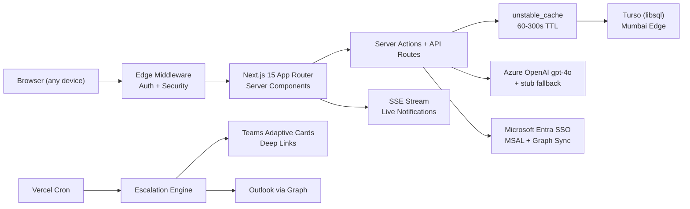

# AtomicPulse — Hackathon Submission

> **AI-first Goal Setting & Tracking Portal** | AtomQuest Hackathon 2026
>
> *The performance OS that writes itself.*

---

## Submission Deliverables

| # | Deliverable | Link |
|---|-------------|------|
| 1 | **Live Demo** | [atomic-pulse-aj5.vercel.app](https://atomic-pulse-aj5.vercel.app) |
| 2 | **Source Code** | [github.com/Adit-Jain-srm/AtomicPulse](https://github.com/Adit-Jain-srm/AtomicPulse) |
| 3 | **Architecture Diagram** | See below + `docs/diagrams/architecture.mmd` |
| 4 | **Login Credentials** | Demo Mode — no passwords needed (see below) |

---

## Login — Role Switcher

The portal uses a **Demo Mode persona switcher**. On the sign-in page, click "Try Demo Mode" and pick any role:

| Role | Persona | Email | What to Test |
|------|---------|-------|-------------|
| **Admin / HR** | Priya Sharma | `priya@atomic.demo` | Org analytics, audit trail, escalations, exports, cycle config |
| **Manager (L1)** | Morgan Chen | `morgan@atomic.demo` | Team dashboard, approve/return goals, check-in ack, shared goal push |
| **Employee** | Diego Alvarez | `diego@atomic.demo` | Draft goals, submit sheet, AI copilot, quarterly check-in |

*Additional personas*: Alex Rivera (submitted), Jordan Park (approved), Sana Khan (locked), and 6 more.

**Microsoft SSO** is also configured — click "Sign in with Microsoft" to test Entra ID flow.

---

## Architecture

### Cost Architecture ($0/month)

| Component | Choice | Monthly Cost |
|-----------|--------|-------------|
| Hosting | Vercel Hobby (serverless, Mumbai) | $0 |
| Database | Turso free tier (500M reads/mo) | $0 |
| AI | Azure OpenAI (stub mode for demo) | $0 |
| Auth | Built-in MSAL (no Auth0/Clerk) | $0 |
| Notifications | Teams webhook + Graph mail | $0 |
| Cache | Framework-level `unstable_cache` | $0 |
| CDN | Vercel Edge (immutable static) | $0 |

---

## BRD Compliance

| Requirement | Implemented | Test Evidence |
|-------------|:-----------:|---------------|
| Goal sheet creation (Thrust Area, UoM, Targets, Weightage) | Yes | `goal-sheet.test.ts` (20 tests) |
| Weightage = 100%, min 10%, max 8 goals | Yes | Edge-case tests (boundary at 9999/10001bp) |
| Manager approve/lock + return for rework | Yes | `manager-review.spec.ts` (3 e2e tests) |
| Shared Goals (push, read-only, sync) | Yes | `shared-goals.spec.ts` (5 e2e tests) |
| Quarterly check-in interface | Yes | `check-ins.spec.ts` (3 e2e tests) |
| Scoring: Min/Max/Timeline/Zero formulas | Yes | `scoring.test.ts` (22 unit tests) |
| Window enforcement (Q1 Jul, Q2 Oct, Q3 Jan, Q4 Mar) | Yes | `state-machine.test.ts` (30 tests) |
| CSV/XLSX achievement export | Yes | `admin.spec.ts` (export tests) |
| Audit trail (post-lock change logging) | Yes | Insert-only `audit_event` table + admin UI |
| Escalation rules (configurable, chain) | Yes | `escalations.test.ts` (26 tests) |
| Analytics (QoQ, heatmap, effectiveness) | Yes | `analytics.spec.ts` (4 e2e tests) |
| Microsoft Entra SSO | Yes | Real MSAL auth code flow |
| Teams + Outlook notifications | Yes | Adaptive Cards with deep links |
| AI Copilot | Yes | 7 skills, live Azure OpenAI, Zod-validated |

---

## Test Suite

| Layer | Count | Status |
|-------|-------|--------|
| TypeScript strict | 0 errors | Pass |
| Unit (Vitest) | **152 tests** | Pass |
| AI Eval | 8 cases | Pass |
| E2E (Playwright) | **45+ specs** | Pass |
| Production Build | 28 routes | Pass |

---

## Key Technical Differentiators

1. **Tri-mode AI** — `stub` (offline/free) → `gateway` (Vercel AI Gateway) → `azure` (direct OpenAI). Demo always works. Live AI generates real insights from actual goal data.

2. **Real Microsoft 365 Integration** — Not mocked. MSAL SSO with user upsert, Graph org sync with manager chain resolution, Teams Adaptive Cards with deep links, Outlook transactional email.

3. **152 Automated Tests** — Every BRD rule tested at boundary conditions. Scoring formulas, validation rules, state machine transitions, edge cases, escalation triggers, analytics aggregation.

4. **End-to-End Lifecycle Proof** — Single Playwright test that walks: employee submit → manager approve → employee check-in — on one database without resets.

5. **$0 Hosting** — Entire app on Vercel Hobby + Turso free tier. No Redis, no external auth provider, no notification SaaS. Framework-level caching with tag-based invalidation.

6. **Production-Ready Security** — Edge middleware auth guard, RBAC on every action, httpOnly signed cookies, security headers (nosniff, DENY framing, strict referrer), insert-only audit trail.

---

## Good-to-Have Features (Section 5 BRD)

| Feature | Implementation Depth |
|---------|---------------------|
| AI Copilot | 7 skills (draft goals, score analysis, risk detection, quarter summary, KPI suggestions). Live Azure OpenAI with 25s timeout + deterministic stub fallback. Live insights on dashboard generated from actual goal data. |
| Microsoft Entra SSO | Real `@azure/msal-node` ConfidentialClientApplication. Auth code flow, token exchange, user upsert/update on login. |
| Graph Org Sync | Pages `/v1.0/users`, resolves manager chains, role mapping from AD group membership (`GRAPH_ADMIN_GROUP_ID`). |
| Teams Notifications | Adaptive Card 1.5 with deep links for every lifecycle event (submit, approve, return, check-in, escalation). |
| Outlook Email | Graph sendMail with HTML templates. Transactional emails for submissions, approvals, returns, reminders. |
| Escalation Engine | 3 configurable triggers, threshold-day chain (owner→manager→skip-level→HR), deduplication, overlap prevention, daily cron. |
| Real-time Notifications | SSE stream polling every 8s, delta-based updates, live unread badge with dropdown panel. |
| Performance Analytics | QoQ trends (LineChart), heatmap (color-coded table), thrust distribution (BarChart), UoM mix (PieChart), manager effectiveness (BarChart). |

---

## About the Developer

**Adit Jain**

| | |
|---|---|
| GitHub | [github.com/Adit-Jain-srm](https://github.com/Adit-Jain-srm) |
| LinkedIn | [linkedin.com/in/-adit-jain](https://www.linkedin.com/in/-adit-jain) |
| Resume | [canva.link/Adit-Jain-CV](https://canva.link/Adit-Jain-CV) |
