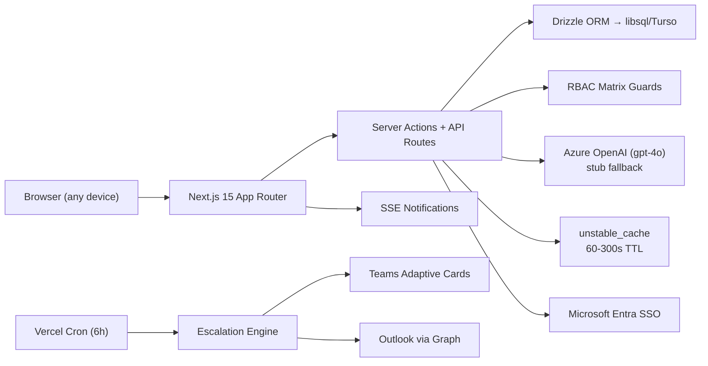

# AtomicPulse — Hackathon Submission

> AI-first Goal Setting & Tracking Portal | AtomQuest Hackathon 2026

---

## Live Demo

| | URL |
|---|---|
| **Hosted portal** | `https://atomic-pulse.vercel.app` *(deploy pending)* |
| **Source code** | [github.com/Adit-Jain-srm/AtomicPulse](https://github.com/Adit-Jain-srm/AtomicPulse) |

---

## Login Credentials

The portal uses a **Demo Mode persona switcher** — no separate credentials needed. On the sign-in page, pick any role:

| Role | Persona | Email |
|------|---------|-------|
| Admin / HR | Priya Sharma | `priya@atomic.demo` |
| Manager | Morgan Chen | `morgan@atomic.demo` |
| Employee | Diego Alvarez | `diego@atomic.demo` |

Additional personas available: Alex Rivera (submitted), Jordan Park (approved), Sana Khan (locked), and 6 more.

---

## Architecture

### Technology Choices (Cost-Optimized)

| Layer | Choice | Why |
|-------|--------|-----|
| Compute | Vercel Serverless (Mumbai) | Pay-per-invocation, zero idle cost |
| Database | Turso (libsql) | Free tier 500M rows, edge replicas |
| AI | Azure OpenAI + stub fallback | Zero cost in demo; 8s timeout prevents runaway bills |
| Auth | MSAL + Demo Mode | Production-ready SSO, zero-config demo |
| Notifications | Teams webhook + Graph mail | No third-party SaaS — uses existing Microsoft 365 |
| Caching | Next.js unstable_cache | In-framework, no Redis needed |
| Static assets | Vercel CDN, immutable headers | Zero origin hits for JS/CSS |

**Estimated monthly cost (50 users):** $0 (Vercel Hobby) to $29 (Turso Pro) — no Redis, no separate notification service, no external auth provider.

---

## BRD Compliance Matrix

| Requirement | Status | Evidence |
|-------------|--------|----------|
| Goal sheet creation (thrust area, UoM, targets, weightage) | Done | `lib/validation/goal-sheet.ts` |
| Weightage = 100%, min 10%, max 8 goals | Done | 20 unit tests + e2e `employee-goals.spec.ts` |
| Manager approve/lock + return for rework | Done | State machine + e2e `manager-review.spec.ts` |
| Shared goals (push, read-only, sync) | Done | 5 e2e tests in `shared-goals.spec.ts` |
| Quarterly check-in interface | Done | e2e `check-ins.spec.ts` |
| System-computed scores (Min/Max/Timeline/Zero) | Done | 22 scoring unit tests |
| Check-in schedule enforcement (Q1 July, Q2 Oct, Q3 Jan, Q4 Mar) | Done | `lib/domain/windows.ts` + tests |
| Achievement export (CSV/XLSX) | Done | API routes + e2e `admin.spec.ts` |
| Audit trail (post-lock change logging) | Done | Insert-only `audit_event` table + admin UI |
| Escalation rules (configurable, chain) | Done | 26 unit tests + cron + admin UI |
| Analytics (QoQ, heatmap, manager effectiveness) | Done | Recharts + 14 analytics unit tests |
| Microsoft Entra SSO | Done | MSAL auth code flow + user upsert |
| Teams & Outlook notifications | Done | Adaptive Cards with deep links + Graph sendMail |
| AI Copilot | Done | 7 skills, Zod-validated, live Azure OpenAI + stub |

---

## Test Suite

| Layer | Count | Duration |
|-------|-------|----------|
| TypeScript strict | 0 errors | ~9s |
| Unit (Vitest) | **152 tests** | <1s |
| AI Eval | 8 cases | ~2s |
| E2E (Playwright) | **45+ specs** | ~3 min |
| Production build | 28 routes | ~50s |

---

## Key Differentiators

1. **Tri-mode AI** — stub (offline/free) → gateway → Azure OpenAI. Demos never break. Live insights generated from actual goal data.
2. **Real Microsoft 365 integration** — not mocked. MSAL SSO, Graph org sync, Teams Adaptive Cards, Outlook email — all behind env flags so demo runs offline.
3. **152 automated tests** — scoring formulas, validation boundaries, state machine transitions, edge cases, escalation triggers, analytics aggregation — all proven.
4. **End-to-end lifecycle chain** — single Playwright test that walks employee submit → manager approve → check-in on one DB without resets.
5. **Production-ready caching** — `unstable_cache` with tag-based invalidation on every mutation. No stale data, no redundant queries.
6. **$0 hosting** — entire app fits on Vercel Hobby + Turso free tier. No Redis, no external auth, no notification SaaS.

---

## About the Developer

| | |
|---|---|
| **Name** | Adit Jain |
| **GitHub** | [github.com/Adit-Jain-srm](https://github.com/Adit-Jain-srm) |
| **LinkedIn** | [linkedin.com/in/-adit-jain](https://www.linkedin.com/in/-adit-jain) |
| **Resume** | [canva.link/Adit-Jain-CV](https://canva.link/Adit-Jain-CV) |
