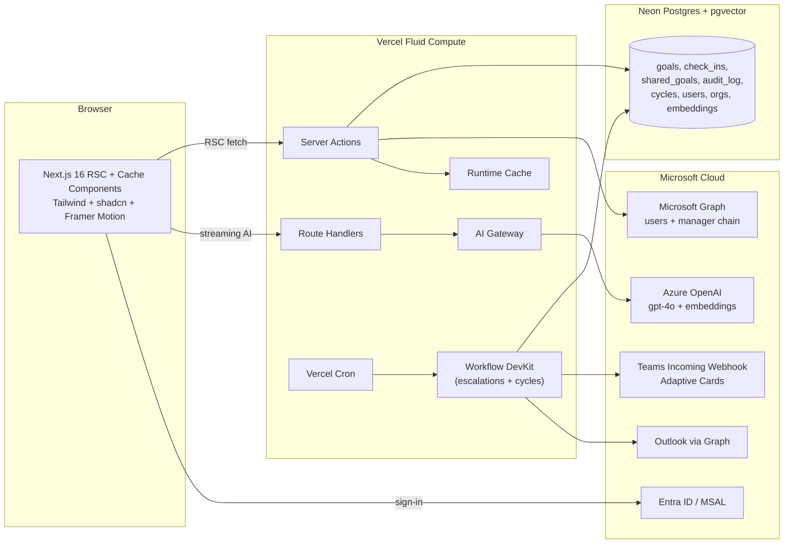
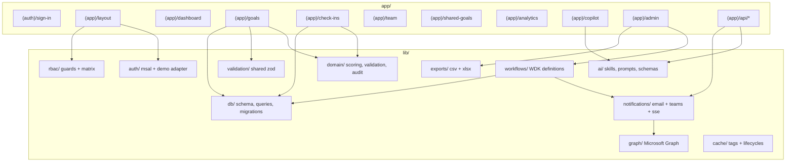
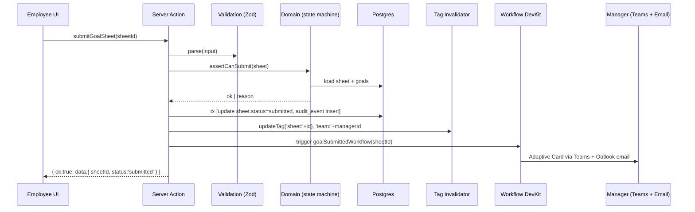
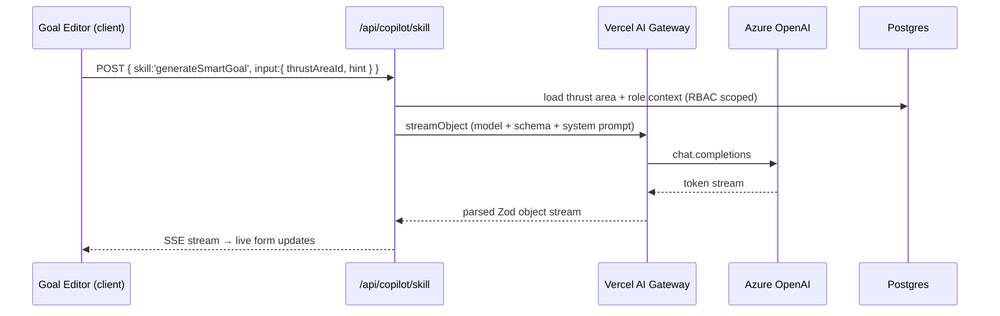

# Architecture — AtomicPulse

## High-Level Diagram

## Module Boundaries

## Request Flow — Goal Submission

## Request Flow — AI "Generate SMART Goal"

## State Machines

### Goal Sheet
`draft → submitted → in_review → (returned → draft) | (approved → locked) → (reopened → draft)`

Reopen / unlock paths are **admin-only** and always insert `audit_event`.

### Check-in
Per-quarter: `pending → in_progress → submitted_by_employee → acknowledged_by_manager`. After window close, transitions become read-only.

## Caching Strategy
- Reads use `use cache` with `cacheLife({ stale: 600, revalidate: 60 })` and `cacheTag` keyed by entity:
  - `org:<id>`, `user:<id>`, `sheet:<id>`, `team:<managerId>`, `cycle:<id>`, `analytics:<orgId>:<cycleId>`.
- Writes call `updateTag` for every affected key.
- AI Gateway prompt cache reuses for stable system prompts + frozen inputs (e.g. "improve clarity" templates).

## Failure Modes & Fallbacks
- **Neon outage** → 503 on writes, cached reads still serve dashboards.
- **Azure OpenAI rate limit** → AI Gateway routes to fallback model `gpt-4o-mini`; if exhausted, surfaces friendly Copilot toast.
- **Teams/Outlook outage** → workflow logs delivery failure; in-app notification still appears.
- **MSAL outage** → Demo Mode remains usable for any seeded user.

## Multi-Tenant Readiness
Every table that holds business data has `org_id`. Drizzle helpers wrap queries with `eq(table.orgId, session.orgId)`. Single seeded org for the hackathon, but the indexes + scoping make N-tenant trivial later.
