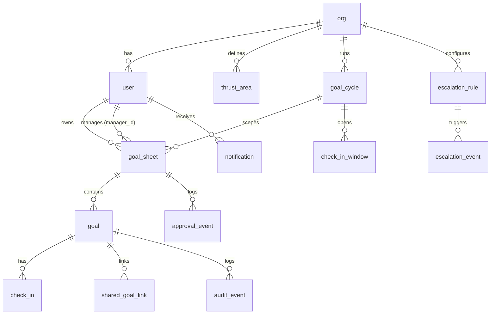

# Database Schema — AtomicPulse

## ER Overview

## Tables (Drizzle DDL summary)

### `org`
- `id` uuid pk
- `name` text not null
- `slug` text unique not null
- `entra_tenant_id` text nullable
- `created_at` timestamptz default now()

### `user`
- `id` uuid pk
- `org_id` uuid fk → org.id (idx)
- `entra_oid` text nullable unique
- `email` citext not null unique
- `display_name` text not null
- `avatar_url` text nullable
- `manager_id` uuid fk → user.id nullable (idx)
- `role` enum (`employee`, `manager`, `admin`) not null default `employee`
- `department` text nullable
- `is_active` boolean default true
- `last_seen_at` timestamptz nullable
- `created_at`, `updated_at`

### `goal_cycle`
- `id` uuid pk
- `org_id` uuid fk
- `fy_label` text (e.g. "FY26")
- `opens_at`, `locks_at` timestamptz — submission window
- `status` enum (`draft`, `open`, `locked`, `closed`)
- unique(`org_id`, `fy_label`)

### `check_in_window`
- `id` uuid pk
- `cycle_id` uuid fk → goal_cycle.id (idx)
- `period` enum (`Q1`, `Q2`, `Q3`, `Q4`)
- `opens_at`, `closes_at` timestamptz
- unique(`cycle_id`, `period`)

### `thrust_area`
- `id` uuid pk
- `org_id` uuid fk (idx)
- `name` text not null
- `description` text nullable
- `color` text default `#2563EB`
- `is_active` boolean default true
- unique(`org_id`, `name`)

### `goal_sheet`
- `id` uuid pk
- `cycle_id` uuid fk (idx)
- `owner_id` uuid fk → user.id (idx)
- `manager_id` uuid fk → user.id (idx) — snapshotted at submission time
- `status` enum (`draft`, `submitted`, `in_review`, `approved`, `locked`, `reopened`)
- `total_weightage_bp` integer (basis points; should equal 10000 when submitted)
- `submitted_at`, `approved_at`, `locked_at`, `reopened_at` timestamptz nullable
- `created_at`, `updated_at`
- unique(`cycle_id`, `owner_id`)

### `goal`
- `id` uuid pk
- `sheet_id` uuid fk (idx)
- `thrust_area_id` uuid fk
- `title` text not null
- `description` text nullable
- `uom_type` enum (`min_num`, `min_pct`, `max_num`, `max_pct`, `timeline`, `zero`)
- `target_value` numeric(18, 4) nullable
- `target_date` date nullable
- `weightage_bp` integer not null (≥1000, sum across sheet = 10000)
- `status` enum (`not_started`, `on_track`, `completed`) default `not_started`
- `current_actual` numeric(18, 4) nullable
- `actual_completion_date` date nullable
- `computed_score_bp` integer nullable (0–10000; 10000 = 100%)
- `source` enum (`self`, `shared`) default `self`
- `shared_link_id` uuid fk → shared_goal_link.id nullable (idx)
- `position` integer (manual ordering)
- `created_at`, `updated_at`

### `shared_goal_link`
- `id` uuid pk
- `primary_goal_id` uuid fk → goal.id (idx)
- `pushed_by` uuid fk → user.id
- `pushed_at` timestamptz default now()
- `note` text nullable

### `check_in`
- `id` uuid pk
- `goal_id` uuid fk (idx)
- `period` enum (`Q1`, `Q2`, `Q3`, `Q4`)
- `actual_value` numeric(18, 4) nullable
- `completion_date` date nullable
- `status` enum (`not_started`, `on_track`, `completed`)
- `employee_note` text nullable
- `manager_comment` text nullable
- `manager_id` uuid fk
- `employee_submitted_at` timestamptz nullable
- `manager_acknowledged_at` timestamptz nullable
- unique(`goal_id`, `period`)

### `audit_event` (insert-only)
- `id` uuid pk
- `org_id` uuid fk
- `entity_type` enum (`goal_sheet`, `goal`, `check_in`, `cycle`, `thrust_area`, `user`)
- `entity_id` uuid not null
- `actor_id` uuid fk → user.id
- `action` text not null (`create`, `update`, `submit`, `approve`, `return`, `lock`, `unlock`, `delete`, `share_push`, `checkin`, ...)
- `before_json` jsonb nullable
- `after_json` jsonb nullable
- `occurred_at` timestamptz default now()
- index(`entity_id`, `occurred_at` desc), index(`org_id`, `occurred_at` desc)
- DB role grant: `INSERT, SELECT` only — no `UPDATE`, no `DELETE`.

### `approval_event`
- `id` uuid pk
- `sheet_id` uuid fk (idx)
- `actor_id` uuid fk → user.id
- `action` enum (`submit`, `return`, `approve`, `unlock`)
- `comment` text nullable
- `occurred_at` timestamptz default now()

### `escalation_rule`
- `id` uuid pk
- `org_id` uuid fk
- `trigger` enum (`no_submit`, `no_approve`, `no_checkin`)
- `threshold_days` integer
- `chain` jsonb (e.g. `[{ to: "owner" }, { to: "manager", afterDays: 3 }, { to: "skip_level", afterDays: 5 }, { to: "hr", afterDays: 7 }]`)
- `is_active` boolean default true

### `escalation_event`
- `id` uuid pk
- `rule_id` uuid fk
- `target_user_id` uuid fk
- `entity_ref` text (e.g. `sheet:<uuid>`)
- `raised_at` timestamptz default now()
- `resolved_at` timestamptz nullable
- `status` enum (`open`, `notified`, `resolved`, `cancelled`)

### `notification`
- `id` uuid pk
- `user_id` uuid fk (idx)
- `channel` enum (`email`, `teams`, `in_app`)
- `type` text
- `title` text
- `body` text
- `link` text nullable
- `payload_json` jsonb nullable
- `created_at` timestamptz default now()
- `read_at` timestamptz nullable

### `embedding` (pgvector)
- `entity_type` text
- `entity_id` uuid
- `content_hash` text
- `vector` vector(1536) — `text-embedding-3-large` truncated; or 3072 if budget allows
- index: `ivfflat (vector vector_cosine_ops)`
- pk(`entity_type`, `entity_id`)

## Local Dev Fallback
For offline demos, a `@libsql/client` adapter mirrors the same Drizzle schema (omitting `vector` columns). Code paths use a `Database` interface; the AI semantic-search module short-circuits to keyword search if `vector` is unavailable.

## Migration Strategy
Drizzle Kit `drizzle-kit generate` + `drizzle-kit migrate`. Each migration is reviewed in PR. Production migrations run via a CI step gated on `branch === main` and an explicit approval label.

## Why basis points?
Weightages and scores live as integers (1% = 100 bp; 100% = 10000 bp). Summing 10 × `10.0` floats can drift from 100.0; integer arithmetic is exact. UI converts at the boundary.
